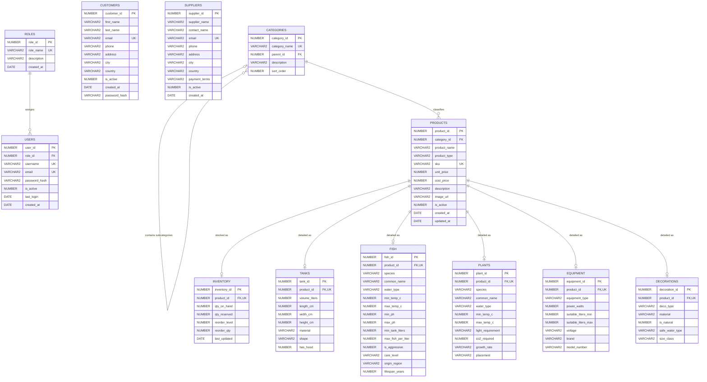
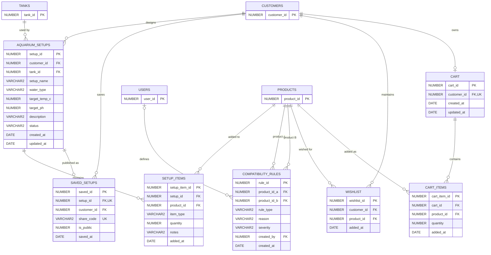
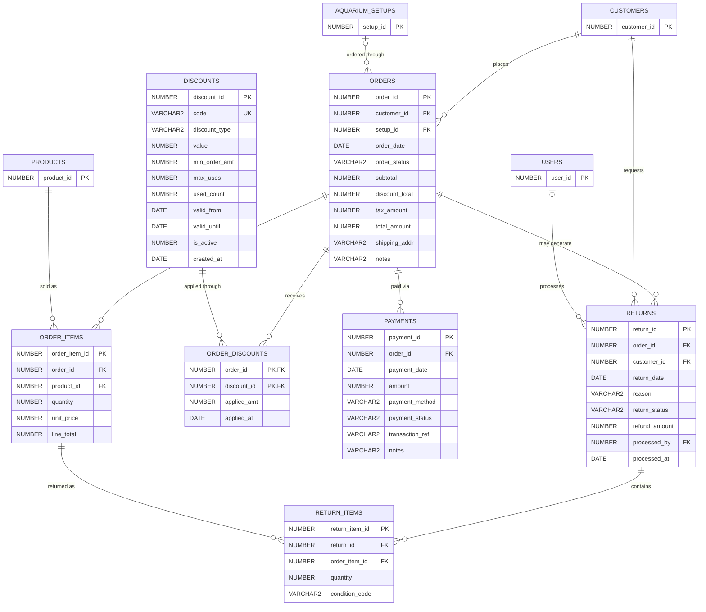
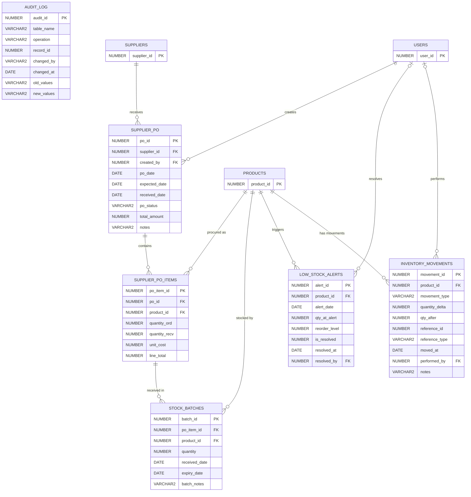

# AquaScape Entity-Relationship Diagrams

This document contains the complete graphical entity-relationship models for the AquaScape Oracle Database, mapped to the 32 physical tables defined in `database/schema/01_core_schema.sql` through `04_supplier_schema.sql`, plus the customer authentication column added by `05_auth_migration.sql`.

The schema is divided into four logical modules for readability.

---

## 1. Core Identity, Catalogue & Inventory

Handles staff access, customers, suppliers, product classification, inventory, and type-specific aquarium product details.

---

## 2. Aquarium Builder, Wishlist & Cart

Supports customer aquarium designs, item compatibility, saved configurations, wishlists, and active shopping carts.

---

## 3. Sales Orders, Discounts, Payments & Returns

Tracks customer purchases, aquarium-builder orders, applied promotions, payment attempts, and product returns.

---

## 4. Supplier Procurement, Stock Control & Auditing

Manages supplier purchase orders, received batches, low-stock alerts, the inventory movement ledger, and database audit history.

---

## Relationship notation

| Symbol | Meaning |
|---|---|
| `||` | Exactly one |
| `o|` | Zero or one |
| `o{` | Zero or many |
| `PK` | Primary key |
| `FK` | Foreign key |
| `UK` | Unique key |

The diagrams reflect physical foreign keys. `AUDIT_LOG` is intentionally independent: its target table and row are recorded generically through `TABLE_NAME` and `RECORD_ID`, not through database foreign keys.
