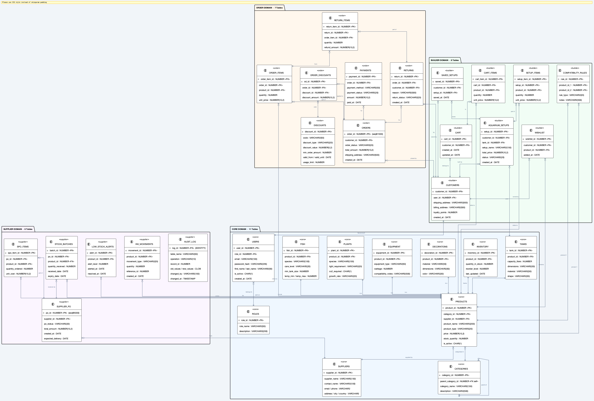

# AquaScape 🐠

**Full-stack Aquarium E-Commerce & Inventory Management System**  
*Database Systems — Course Project*

---

## Overview

AquaScape is a full-stack platform for an aquarium retail business, supporting two user groups:

- **Staff / Admin** — manage products, inventory, orders, and suppliers
- **Customers** — browse the shop, build custom aquarium setups, and place orders

All critical business logic is implemented as **Oracle PL/SQL** stored procedures and functions, ensuring data integrity at the database level.

---

## Tech Stack

| Layer | Technology |
|---|---|
| Database | Oracle Database Express Edition 21.3.0-XE |
| Backend | Node.js 20 + Express.js |
| Frontend | React 18 + Vite + Tailwind CSS |
| Containerisation | Docker / Docker Compose |

---

## Database Design

The schema is organised into **4 functional domains** across **32 tables**:

| Domain | Tables | Description |
|---|---|---|
| **Core** | 11 | Roles, Users, Customers, Suppliers, Products, Inventory, and type-specific tables (Fish, Plants, Tanks, Equipment, Decorations) |
| **Builder** | 8 | Aquarium Setups, Setup Items, Cart, Cart Items, Wishlist, Saved Setups, Compatibility Rules |
| **Order** | 7 | Orders, Order Items, Payments, Discounts, Order Discounts, Returns, Return Items |
| **Supplier** | 6 | Supplier POs, PO Items, Stock Batches, Low Stock Alerts, Inventory Movements, Audit Log |

### ER Diagram



---

## Project Structure

```
AquaScape/
├── database/
│   └── schema/          # Oracle DDL scripts
├── backend/             # Node.js / Express API
├── frontend/            # React + Vite app
└── docker-compose.yml   # One-command setup
```

---

## Getting Started

```bash
# 1. Start all services (Oracle XE + backend + frontend)
docker compose up -d

# 2. Run schema scripts (after Oracle is healthy)
sqlplus AQUASCAPE/AquaScape123@localhost:1521/XEPDB1 @database/schema/00_create_user.sql
sqlplus AQUASCAPE/AquaScape123@localhost:1521/XEPDB1 @database/schema/01_core_schema.sql

# 3. Frontend available at http://localhost:5173
```

---

## Week 1 Progress

- [x] Project proposal and scope definition
- [x] Domain analysis — identified 4 functional domains, 32 entities
- [x] Conceptual ER diagram (crow's foot notation, colour-coded domains)
- [x] Core domain schema DDL (`01_core_schema.sql` — 11 tables, sequences, constraints)
- [x] Development environment — Oracle XE running in Docker
- [x] Frontend skeleton — login, dashboard, product catalog pages
